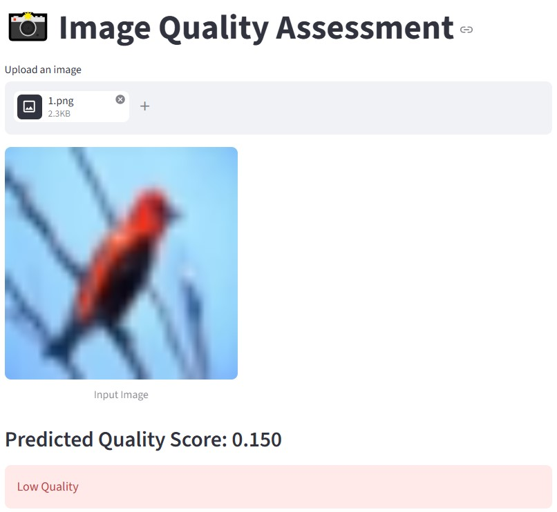
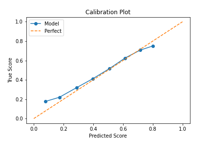

# Image Quality Assessment using Deep Learning

A deep learning project for predicting image quality using convolutional neural networks and explainability techniques.

---

## Overview

This project implements a **Image Quality Assessment (IQA)** system using deep learning.
Given an input image, the model predicts a **quality score (0–1)** aligned with human perception.

---

## Features

* Deep CNN model (ResNet-based)
* High performance:

  * **PLCC ≈ 0.86**
  * **SRCC ≈ 0.82**
* Explainability with Grad-CAM
* Calibration analysis
* Failure case analysis
* Interactive demo (Streamlit)

---

## Dataset

We use the **KonIQ-10k dataset**, a large-scale image quality dataset.

### Download:

https://www.kaggle.com/datasets/generalhawking/koniq-10k-dataset

After downloading:

```
data/
├── 512x384/
│   ├── image1.jpg
│   ├── ...
│
└── koniq10k_distributions_sets.csv
```

---

## Installation

```bash
git clone https://github.com/MahdisHassani/Image-Quality-Assessment.git
cd Image-Quality-Assessment

pip install -r requirements.txt
```

---

## Training

```
python train.py
```

---

## Evaluation

```
python eval.py
```

---

## Failure Analysis

Find where the model fails and why:

```
python analyze_failures.py
```

Outputs:

```
failure_analysis/
├── sample_0.jpg
├── sample_1.jpg
```

---

## Grad-CAM Visualization

```
python gradcam.py
```

---

## Calibration Plot

Check if predictions align with ground truth:

```
python calibration.py
```

Output:

```
results/calibration_plot.png
```

---

## Demo (Streamlit)

```
streamlit run app.py
```

Upload an image and get quality prediction instantly.

Below is a snapshot of the Streamlit web interface:

<p align="center">
  
</p>

---

## Model Details

* Backbone: ResNet34 (pretrained on ImageNet)
* Loss: MSE + L1
* Output: Sigmoid (range [0,1])
* Input size: 224×224

---

## Metrics

* **PLCC (Pearson Linear Correlation)**
* **SRCC (Spearman Rank Correlation)**

These metrics measure how well predictions align with human perception.

---

## Results

| Metric | Value |
| ------ | ----- |
| PLCC   | 0.8626 |
| SRCC   | 0.8278 |

---

## Calibration Analysis

To evaluate how well the predicted quality scores align with ground truth values, we use a calibration plot.



### Interpretation

- The dashed diagonal line represents a **perfectly calibrated model**
- The blue curve shows the model's actual predictions

The model is reasonably well-calibrated, with predictions closely following the ideal diagonal line.  
However, slight deviations indicate minor bias in certain quality ranges, especially for low-quality images.

This suggests that while the model performs well in ranking images (high SRCC), there is still room for improvement in score prediction.

---
